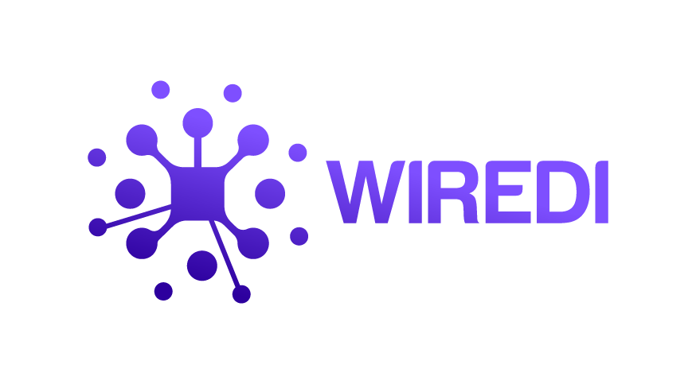

# WireDI



## Links:

- [Documentation](https://docs.thorbenkuck.de/wiredi)
- [Maven-Central](https://repo1.maven.org/maven2/com/github/thorbenkuck/wire-di-bootstrap/)

What started as a proof of concept (originally named SimpleDI) to show, that dependency injection could be done at compile time, while keeping the features of reflections, grew up to become a very powerful framework, providing a lot of functionality (including aspect oriented proxies), all at compile time.

But let's start at the important questions:

## What does this framework do exactly?

In its core, this framework enables dependency injection. You add one annotation to a class you want to be wired by this framework, namely @Wire like this:

```java
@Wire
class YourClass {
    // Fields, methods, constructors etc.
}
```

and then you can extract the class with all wired classes like this:

```java
WireRepository wireRepository = WireRepository.open();
YourClass instance = wireRepository.get(YourClass.class);
```

All classes which you want to connect in this fashion have to be annotated with @Wire.

### So, how does this framework differ from other frameworks?

This framework does not work as other frameworks. It does work at compile time. Multiple annotation processors pick up different annotations and create certain other instances of suppliers.

### Ah, so it is one of those frameworks...

Yes and no. It does a lot of work at compile time, but not completely. Instead, it extracts the reflection heavy operations and does them at compile time. After compile time, it neatly snuggles into a more traditional framework. You can add custom instances, custom Aspects and other relevant informations all at runtime.

It is not recommended, but you can certainly do that. And this allows us to enter a whole new dimension. We can fit this framework with relative ease into other, already existing frameworks, combining the power of annotation processors and the already existing ecosystem of runtime DI and IOC.

We can go even as far as declaring aspects at runtime, even though the proxies are build at compile time. But let us start from the beginning:

## Installation

You require hooking up one annotation processor and the api, as well as the core api. You can do that simply, by adding this parent to your pom.xml

```xml
<parent>
    <groupId>com.wiredi</groupId>
    <artifactId>bootstrap</artifactId>
    <version>1.0.0-alpha2</version>
    <relativePath/> <!-- Always look up parent from repository -->
</parent>
```

this introduces the wire-di annotation processor and wire-di-runtime-environment, which allows to utilize the data, generated at compile time, at runtime.

For other forms of introducing this library to your application, see the [usage section of the documentation](https://docs.thorbenkuck.de/wiredi/#/usage/).

## Basic usage

The central annotation to mark classes as "I want to be able to be handled for di" is called `Wire`. This annotation marks a class as "Injection enabled", allowing the framework to inject it into other classes and other classes into it.

A very simple example would look like this:

```java
@Wire
class A {
    private final B b;
    
    public A(B b) {
        this.b = b;
    }
}

@Wire
class B {}

public class Main {
    public static void main(String[] args)  {
        WireRepository wireRepository = WireRepository.open();
        A a = wireRepository.get(A.class);
        // Do fancy stuff
    }
}
```

In this example right here, we have two classes, A and B and A has a dependency to B. Since both classes are marked with `@Wire`, the framework can identify these classes and inject them safely into each other.

As you run this code, a lot happens behind the curtains. The annotation processor generates instance of `IdentifiableProvider` classes, which you can even see in the compiled sources. These providers hold a sum of static information about this class, that are then used at runtime; Including the template as to how this class is created.
